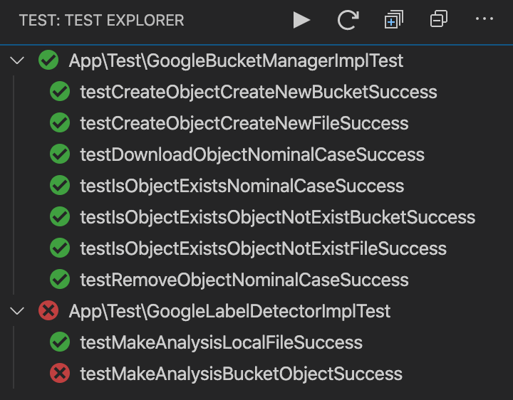

# ManagingApi

Ce projet à lieu dans le cadre du CPNV pour le module RIA2.

Les pré-requis pour utiliser ce projets se trouvent à cet [endroit](./docs/environnement.md).

Afin de faire fonctionner ce projet, merci de suivre la marche à suivre suivante :

- Clonez le repository
- Executer `cd managingApi/`
- Executer `composer install`
  - L'erreur suivante risque de se produire : `theseer/fxsl 1.1.1 requires ext-xsl * -> the requested PHP extension xsl is missing from your system.`
  - Ouvrez le fichier php.ini et retirer le `;` qui précède `extension=xsl`
  - Relancer la commande `composer install`
- Renommer `.env.example` `mv .env.example .env` (fonctionne sur un environnement linux)
- Ajouter les informations dans le fichier `.env`
- Lancez votre application avec la commande suivante : `cd ./public && php -S 127.0.0.1:9999`
- Vous pouvez accéder à votre application à l'adresse `127.0.0.1:9999`

## Helper

Pour plus d'informations sur les points suivant et suivre notre analyse vous pouvez consulter le [document suivant](./docs/analyser.md).

La documentation pour l'environnement de travail est dans le [document suivant](./docs/environnement.md).

La documentation pour les dépendances du serveur sont sur [ce document](./docs/dependances.md).

### phpdox

pour générer la doc, vous pouvez utiliser la commande `vendor/bin/phpdox` qui vou generera un dossier [phpdox](./docs/phpdox) avec tout les fichiers, une version en xml et une en xhtml, vous pouvez consulter la doc à [cette addresse](./docs/phpdox/html/html/index.xhtml),

### phpunit

Pour executer tous les tests, il faut utiliser la commande `vendor/bin/phpunit model --testdox`, celui-ci lance les tests directement. En cas de problèmes, vous pouvez vous fier à la [documentation](https://phpunit.readthedocs.io/fr/latest/writing-tests-for-phpunit.html) de phpunit.

Il est possible d'éxécuter les test sur un modéle spécifique grâce à `vendor/bin/phpunit [folder]/[FileTest.php] --testdox`.

### PHPUnit Test Explorer
Afin d'effectuer nos différents tests, nous avons utilisé cet outil pour VS Code. Vous retrouverez les informations sur cet outils sur ce [lien](./docs/environnement.md)

## Rendu
Voici l'etat actuel de nos tests :

Le dernier test ne passe pas car nous n'avons pas trouvé l'uri pour notre bucket + image. Cependant, le test est opérationnel en cas de bonne uri.

Développeurs :
- Alexandre Junod
- Nicolas Henry
